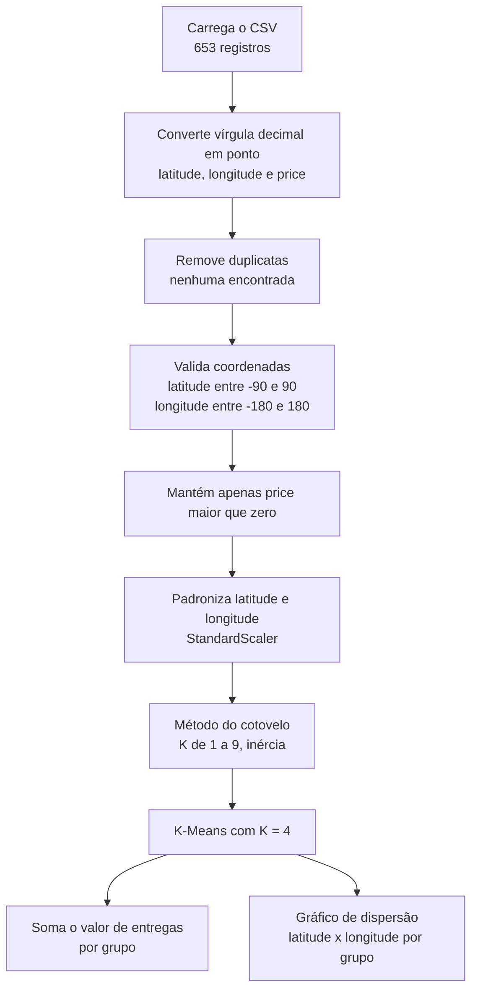

# Análise de Centros de Distribuição com K-Means

Agrupamento geográfico de 653 pontos de entrega em quatro regiões, para apoiar a decisão de onde posicionar centros de distribuição.

## Contexto

Uma empresa que entrega produtos em uma região extensa precisa decidir quantos centros de distribuição manter e onde. Pontos de entrega muito distantes do centro que os atende aumentam custo e prazo. Agrupar as entregas por proximidade é um primeiro passo para dividir o território em áreas de atendimento.

## Solução

Um notebook Jupyter que limpa os dados de localização, escolhe o número de grupos com o método do cotovelo, aplica o algoritmo **K-Means** e calcula o valor total de entregas de cada grupo.

O conjunto de dados é o de geolocalização do curso FIAP On (Fase 6). Ele tem três colunas: `latitude`, `longitude` e `price` (valor da entrega).

## Competências demonstradas

- **Qualidade de dados:** conversão de formato numérico, checagem de duplicatas, validação de faixa das coordenadas e remoção de valores inválidos, com o resultado de cada etapa registrado.
- **Pré-processamento para Machine Learning:** padronização das variáveis antes de um algoritmo baseado em distância.
- **Aprendizado não supervisionado:** K-Means com escolha do número de grupos pelo método do cotovelo e semente fixa para reprodutibilidade.
- **Tradução para o negócio:** valor de entregas por grupo, participação de cada região e leitura crítica das limitações.

## Lógica da análise

**Por que padronizar?** O K-Means usa distâncias. Padronizar coloca latitude e longitude na mesma escala, para que nenhuma domine o cálculo.

**Por que o método do cotovelo?** O K-Means exige que o número de grupos seja informado. A inércia (soma das distâncias internas aos grupos) sempre cai quando K aumenta, e o ponto em que a queda desacelera indica um valor razoável. Aqui, a inércia cai de cerca de 1.300 (K=1) para cerca de 570 (K=2) e para cerca de 315 (K=4), e o ganho diminui bastante depois de K=4.

**Por que `random_state=42`?** O K-Means parte de centros iniciais aleatórios. Fixar a semente torna o resultado reproduzível.

## Resultados

Valor total de entregas por grupo (K = 4):

| Grupo | Valor total | Participação |
|---|---|---|
| 0 | 11.971,48 | 29,1% |
| 1 | 12.425,34 | 30,2% |
| 2 | 7.432,42 | 18,0% |
| 3 | 9.354,57 | 22,7% |
| **Total** | **41.183,81** | **100%** |

No gráfico de dispersão, os quatro grupos ocupam regiões geográficas distintas, com fronteiras próximas entre vizinhos. Os grupos 0 e 1 concentram cerca de 59% do valor.

## O que existe no repositório

| Arquivo | Conteúdo |
|---|---|
| `analise_python_centros_distribuicao.ipynb` | Notebook com toda a análise (14 células). |

O arquivo de dados **não está incluído**: ele foi fornecido no curso e não é redistribuído aqui.

## Como executar

**Pré-requisitos:** Python 3 com `pandas`, `matplotlib`, `seaborn` e `scikit-learn`. O notebook foi feito no Google Colab e instala esses pacotes na primeira célula.

1. Obtenha o arquivo CSV de geolocalização (colunas `latitude`, `longitude` e `price`).
2. Abra o notebook no Google Colab e carregue o CSV na sessão. A segunda célula lê o arquivo a partir da variável `uploaded`, criada pelo upload do Colab.
3. Fora do Colab, substitua a leitura dessa célula por `df = pd.read_csv("caminho/do/arquivo.csv")`.
4. Execute as células em sequência.

## Pontos de atenção e próximos passos

- **Locais dos centros.** O notebook agrupa as entregas, mas não calcula as coordenadas de cada centro. Elas seriam os centroides (`cluster_centers_`), convertidos de volta à escala original com `scaler.inverse_transform`.
- **Escolha de K.** No código, K=4 aparece com o comentário "Exemplo, substitua pelo valor ideal", e o cotovelo do gráfico é suave. Complementar com o coeficiente de silhueta daria mais segurança.
- **Distância em graus.** O K-Means usa distância euclidiana sobre latitude e longitude padronizadas. Para distâncias em quilômetros, o cálculo apropriado é a distância de Haversine.
- **Peso do valor.** O agrupamento não considera o valor de cada entrega. Usar `sample_weight` no K-Means aproximaria a solução do volume atendido.
- **Cobertura e rotas.** O notebook não calcula distâncias, tempos ou rotas. Esses indicadores ficam como evolução do projeto.
- Um mapa interativo (por exemplo, com Folium) tornaria a visualização mais próxima do uso real.

### Caminho para produção e para IA

1. **Pipeline reprodutível fora do Colab:** ler o arquivo por caminho configurável, fixar versões das bibliotecas e transformar as etapas em funções testáveis.
2. **Validação do agrupamento:** coeficiente de silhueta, coordenadas dos centros em graus e distâncias em quilômetros.
3. **Da segmentação à decisão:** com dados de demanda e de custo por rota, evoluir para otimização de localização (por exemplo, o problema da p-mediana) e para previsão de demanda por região.

## Autoria

Dayanne Simão | [LinkedIn](https://www.linkedin.com/in/dayannesimao/)

Projeto acadêmico. Uso para estudo e referência, com crédito à autora.
